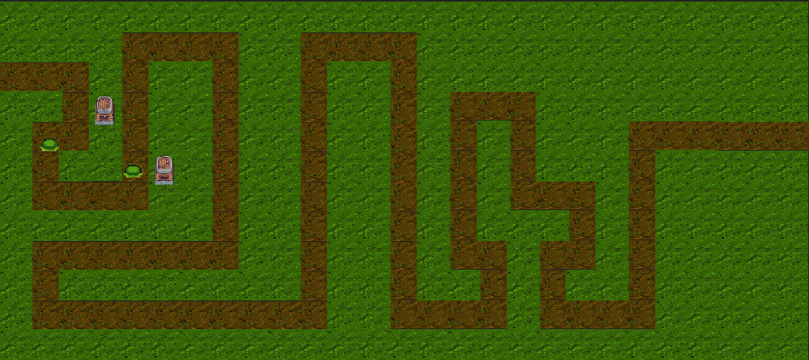
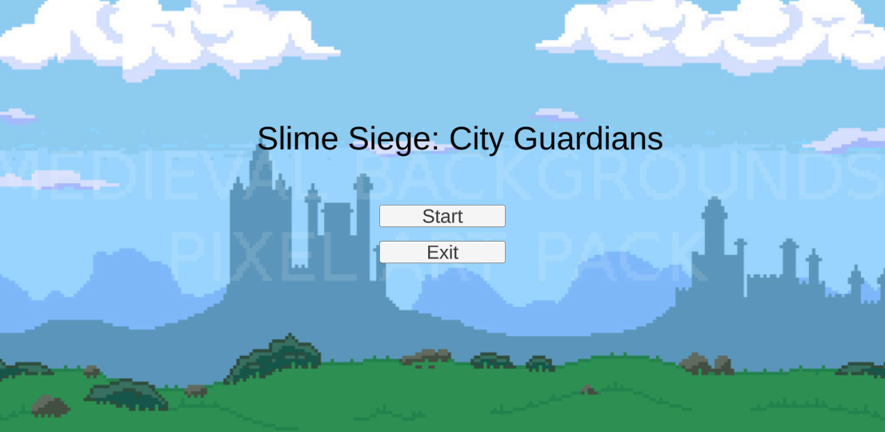
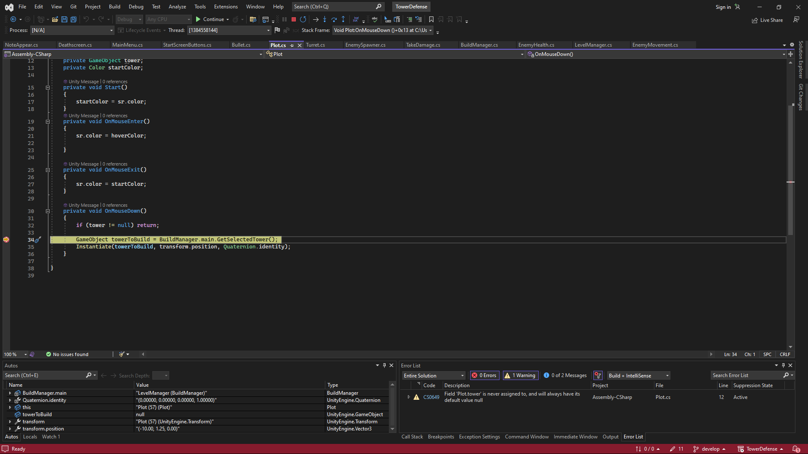
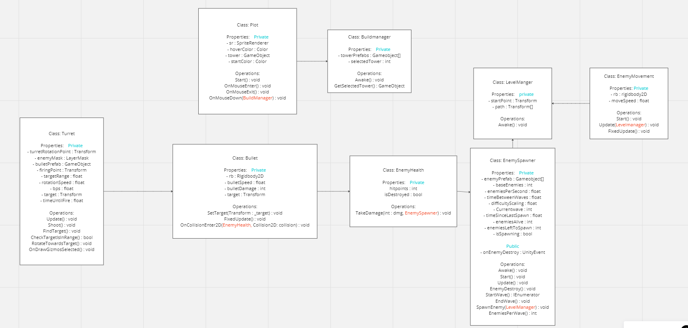

# TowerDefenseTemplate

"In deze game moet je de stad beschermen van aanvallende monsters, Plaats torens en verdedig de stad tegen de slijms!"

## Product 1: "DRY SRP Scripts op GitHub"

"in dit script maak ik gebruik van een array zodat ik de prefabs niet met meerdere variablen aan hoef te roepen wat het **DRY** maakt. Voor **SRP** heb ik elke fuctie die maar 1 functie uitvoert zoals bij *StartWave()* is het enigste wat die functie doet is de wave starten en *SpawnEnemy() en EndWave()* helpen daarbij om het wave systeem af te maken."

[link naar script](TowerDefense/Assets/Scripts/EnemyScripts/EnemySpawner.cs)"

## Product 2: "Projectmappen op GitHub"

Dit is de [ROOT](TowerDefense) folder van mijn unity project.

## Product 3: Build op Github

Je maakt in Unity een stabiele “build” van je game waarbij bugs en logs eerst zijn verwijderd. Deze buildfiles upload je in je repository onder releases.  Bij eventuele afwijkingen moeten deze worden gedocumenteerd in de release. (Bijv controller nodig of spelen via netwerk etc..)

[Release Voorbeeld](https://github.com/erwinhenraat/TowerDefenseTemplate/releases)

## Product 4: Game met Sprites(animations) en Textures

## Product 5: Issues met debug screenshots op GitHub

"Ik had een bug dat ik meerdere torens op het zelfde vakje kon plaatsen, dat heb ik gefixt door een **boolean** aan te maken die checkt of er al een toren staat ja of te nee"

## Product 6: Game design met onderbouwing

* **Je game bevat torens die kunnen mikken en schieten op een bewegend doel.**

"Mijn torens kunnen draaien in een bepaalde radius en schieten als er een enemy in hun radius is."

* **Je game bevat vernietigbare vijanden die 1 of meerderen paden kunnen volgen.**  
  
"Mijn vijanden volgen een waypoint systeem waardoor ze 1 pad kunnen volgen en ze hebben een bepaald aantal levens en als die op zijn wordt de vijand vernietigd."

* **Je game bevat een “wave” systeem waarmee er onder bepaalde voorwaarden (tijd/vijanden op) nieuwe waves met vijanden het veld in komen.**

"Er zijn waves die spawnen en als alle vijanden dood of aan het einde van het pad zijn wordt er een nieuwe wave gestart die meer enemies spawnt en zo gaat dat oneindig door"

* **Een “health” systeem waarmee je levens kunt verliezen als vijanden hun doel bereiken en zodoende het spel kunt verliezen.**

"als de vijanden het einde van het pad bereiken gaat er levens van de speler af en als die op 0 komt ben je game over."

* **Een “resource” systeem waarmee je resources kunt verdienen waarmee je torens kunt kopen en .evt upgraden.**

"die heb ik niet gedaan"

* **Een “upgrade” systeem om je torens te verbeteren.**

"die heb ik niet gedaan"

* **Een “movement prediction” systeem waarmee je kan berekenen waar een toren heen moeten schieten om een bewegend object te kunnen raken. (Moeilijk)**

"die heb ik niet gedaan"

## Product 7: Class Diagram voor volledige codebase

## Product 8: Prototype test video

## Product 9: SCRUM planning inschatting

[Link naar de openbare trello](https://trello.com/b/9QFKsROT/scrum-board)

## Product 10: Gitflow conventions

"Ik heb de **develop** branch gebruikt om normale updates uit te voeren en ik gebruik de **master** branch voor release updates."
